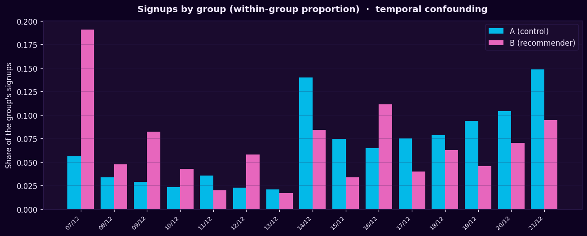
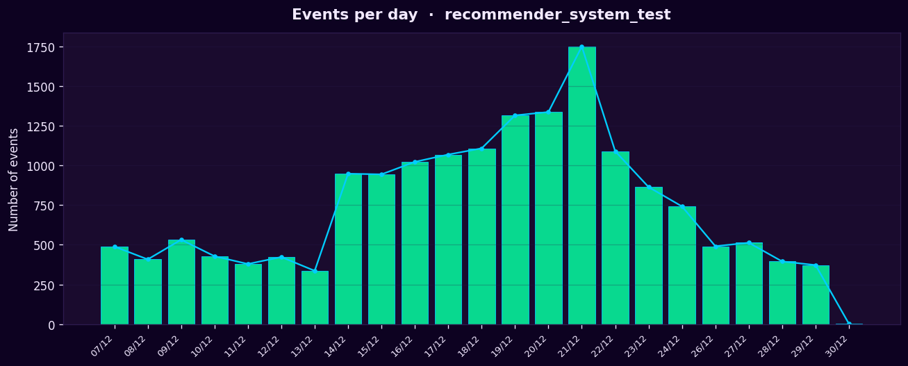

# A/B Test — Recommender System Analysis

Analysis of an A/B test for a new recommendation system at an international e-commerce store — with a focus on **test validity before statistical significance**.

> **Language:** English (this file) · [Português](README_pt.md)

---

## Context

The test (`recommender_system_test`) was launched by a previous analyst who left the company before completing it — leaving behind only the technical specification and the raw results. The task was to pick up the analysis: check whether the test was conducted correctly and evaluate its outcome.

The core lesson of the project is methodological: **a p-value is meaningless if the experiment behind it is broken.** So the analysis validates the test design first, and only then runs the statistical test.

## Objective

1. **Validate** whether the test was conducted correctly (sample size, group balance, contamination, external factors).
2. **Evaluate**, via a two-proportion z-test, whether group B (recommender) outperforms group A (control) across the conversion funnel.

**Business hypothesis:** within 14 days of registration, group B shows at least a **10% higher conversion** than group A at each funnel stage — `product_page → product_cart → purchase`.

## Dataset

Four datasets provided by the store (event calendar, new users, events, and test participants). The data is course material and is **not redistributed** in this repository — see [`.gitignore`](.gitignore). The notebook reads the files from a local `/datasets/` path.

| Spec parameter | Value |
|----------------|-------|
| Test window | 2020-12-07 → 2021-01-01 (registration until 2020-12-21) |
| Audience | 15% of new EU users |
| Expected participants | ~6000 |

## Tech stack

`Python` · `pandas` · `NumPy` · `Matplotlib` · `SciPy` · `Jupyter`

## Method

1. **Loading & typing** — date fields converted to `datetime`; structural nulls in `details` documented and kept (only `purchase` events carry a monetary value).
2. **Design validation** — headcount vs spec, group balance, cross-test contamination, region scope, observation window, marketing overlap.
3. **EDA** — signup distribution by group, events per user, participant presence, events per day, funnel conversion.
4. **A/B test** — two-proportion z-test at each funnel stage, with **Bonferroni correction** (α = 0.05 / 3 = 0.0167) for multiple comparisons.

## Key findings — why the test is compromised

The validation surfaced several design flaws that undermine any comparison between groups:

- **Undersized sample** — 2594 valid participants vs ~6000 expected (−57%); group B has only 655 users → low statistical power.
- **Structural imbalance** — ~75/25 allocation (A/B), persistent after every cleaning step, so it stems from the original allocation, not from filtering.
- **Cross-test contamination** — 24% of the original participants were also enrolled in a parallel test (`interface_eu_test`) on the same audience and window; removed, but a sign of poor experiment management.
- **Temporal confounding** — group B registered early in the window, group A late, producing unequal observation windows and different exposure to the holiday promotion.
- **14-day window not honored** — usable data ends on 2020-12-29; late registrants never had a full 14-day observation window.
- **Uncontrolled external factor** — a *Christmas & New Year* promotion (EU) was active over the last days of the window, affecting conversion unevenly across groups.

## Results

**Funnel conversion (share of each group's participants):**

| Stage | A (control) | B (recommender) | B − A |
|-------|-------------|-----------------|-------|
| product_page | 65.24% | 56.03% | −9.2 pp |
| product_cart | 30.38% | 28.09% | −2.3 pp |
| purchase | 31.61% | 29.16% | −2.5 pp |

**z-test (α = 0.0167, Bonferroni):**

| Stage | p-value | Decision | Direction |
|-------|---------|----------|-----------|
| product_page | 0.0000 | Reject H₀ | A > B |
| product_cart | 0.2690 | Fail to reject H₀ | — |
| purchase | 0.2404 | Fail to reject H₀ | — |

Group B did **not** outperform group A at any stage. The only statistically significant difference (`product_page`) favors the **control**.

## Conclusion & recommendation

The hypothesis (B ≥ A + 10%) was **not confirmed**. More importantly, the test is too compromised for a reliable decision in any direction. **Recommendation: do not implement the new recommender system based on this test.** The experiment should be repeated with balanced allocation, a complete sample, isolation from concurrent tests, a marketing-free window, and a period that guarantees the full 14-day observation window for every participant.

The value delivered here is not the verdict on the recommender — it's the diagnosis that the test cannot support one.

## Charts

| Signups by group (temporal confounding) | Events per day | Funnel conversion |
|---|---|---|
|  |  |  |

## How to run

1. Place the four CSV files in a `datasets/` folder (or adjust the paths in the notebook).
2. Open the notebook and run **Kernel → Restart & Run All**.

```bash
pip install pandas numpy matplotlib scipy jupyter
jupyter lab
```

---

*Part of a data analyst portfolio. Built with a guided/Socratic workflow.*
