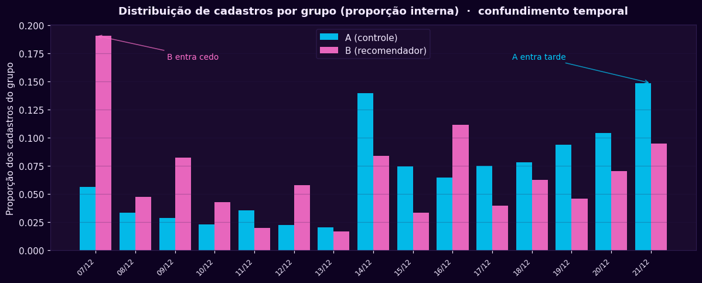
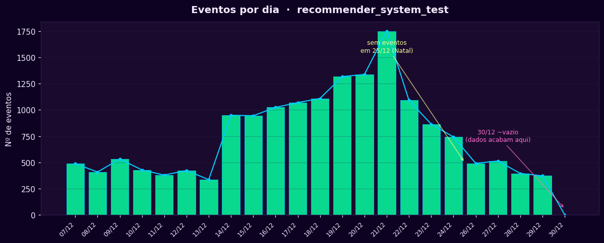
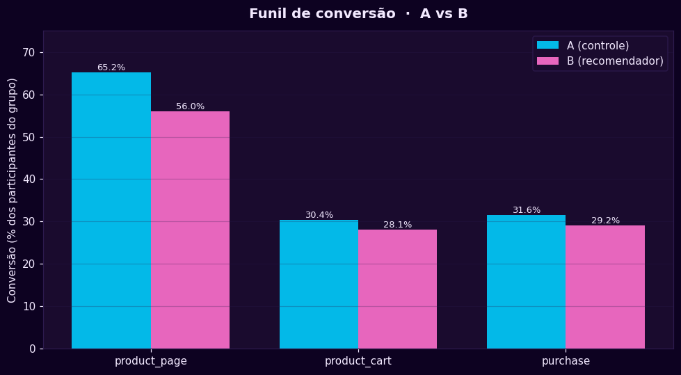

# Teste A/B — Análise de Sistema de Recomendação

Análise de um teste A/B de um novo sistema de recomendação em uma loja online internacional — com foco em **validade do teste antes da significância estatística**.

> **Idioma:** Português (este arquivo) · [English](README.md)

---

## Contexto

O teste (`recommender_system_test`) foi lançado por um analista anterior que deixou a empresa antes de concluí-lo — deixando apenas a especificação técnica e os resultados brutos. A tarefa foi retomar a análise: verificar se o teste foi conduzido corretamente e avaliar seu resultado.

A lição central do projeto é metodológica: **um p-valor não significa nada se o experimento por trás dele estiver quebrado.** Por isso a análise valida o desenho do teste primeiro, e só então roda o teste estatístico.

## Objetivo

1. **Validar** se o teste foi conduzido corretamente (tamanho de amostra, balanceamento dos grupos, contaminação, fatores externos).
2. **Avaliar**, via z-test de duas proporções, se o grupo B (recomendador) supera o grupo A (controle) ao longo do funil de conversão.

**Hipótese de negócio:** em até 14 dias após o cadastro, o grupo B apresenta conversão **pelo menos 10% maior** que o grupo A em cada etapa do funil — `product_page → product_cart → purchase`.

## Dados

Quatro conjuntos de dados fornecidos pela loja (calendário de eventos, novos usuários, eventos e participantes do teste). Os dados são material do curso e **não são redistribuídos** neste repositório — ver [`.gitignore`](.gitignore). O notebook lê os arquivos de um caminho local `/datasets/`.

| Parâmetro da spec | Valor |
|-------------------|-------|
| Janela do teste | 07/12/2020 → 01/01/2021 (cadastro até 21/12/2020) |
| Público | 15% dos novos usuários da UE |
| Participantes esperados | ~6000 |

## Tecnologias

`Python` · `pandas` · `NumPy` · `Matplotlib` · `SciPy` · `Jupyter`

## Método

1. **Carregamento e tipagem** — campos de data convertidos para `datetime`; nulos estruturais em `details` documentados e mantidos (apenas eventos `purchase` carregam valor monetário).
2. **Validação do desenho** — headcount vs spec, balanceamento dos grupos, contaminação entre testes, escopo de região, janela de observação, sobreposição com marketing.
3. **AED** — distribuição de cadastros por grupo, eventos por usuário, presença dos participantes, eventos por dia, conversão do funil.
4. **Teste A/B** — z-test de duas proporções em cada etapa do funil, com **correção de Bonferroni** (α = 0,05 / 3 = 0,0167) para comparações múltiplas.

## Principais achados — por que o teste está comprometido

A validação revelou diversas falhas de desenho que inviabilizam qualquer comparação entre grupos:

- **Amostra subdimensionada** — 2594 participantes válidos vs ~6000 esperados (−57%); o grupo B tem apenas 655 usuários → baixo poder estatístico.
- **Desbalanceamento estrutural** — alocação ~75/25 (A/B), persistente após todos os cortes, logo é da alocação original, não da filtragem.
- **Contaminação cruzada** — 24% dos participantes originais também estavam em um teste paralelo (`interface_eu_test`) no mesmo público e período; removidos, mas sinal de má gestão de experimentos.
- **Confundimento temporal** — o grupo B se cadastrou no início da janela e o grupo A no fim, gerando janelas de observação desiguais e exposição diferente à promoção de fim de ano.
- **Janela de 14 dias não respeitada** — os dados úteis terminam em 29/12/2020; usuários tardios nunca tiveram os 14 dias completos de observação.
- **Fator externo não controlado** — uma promoção de *Natal e Ano Novo* (UE) esteve ativa nos últimos dias da janela, afetando a conversão de forma desigual entre os grupos.

## Resultados

**Conversão do funil (proporção dos participantes de cada grupo):**

| Etapa | A (controle) | B (recomendador) | B − A |
|-------|--------------|------------------|-------|
| product_page | 65,24% | 56,03% | −9,2 pp |
| product_cart | 30,38% | 28,09% | −2,3 pp |
| purchase | 31,61% | 29,16% | −2,5 pp |

**z-test (α = 0,0167, Bonferroni):**

| Etapa | p-valor | Decisão | Direção |
|-------|---------|---------|---------|
| product_page | 0,0000 | Rejeita H₀ | A > B |
| product_cart | 0,2690 | Não rejeita H₀ | — |
| purchase | 0,2404 | Não rejeita H₀ | — |

O grupo B **não** superou o grupo A em nenhuma etapa. A única diferença estatisticamente significativa (`product_page`) é a favor do **controle**.

## Conclusão e recomendação

A hipótese (B ≥ A + 10%) **não foi confirmada**. Mais importante: o teste está comprometido demais para uma decisão confiável em qualquer direção. **Recomendação: não implementar o novo sistema de recomendação com base neste teste.** O experimento deveria ser repetido com alocação balanceada, amostra completa, isolamento de testes simultâneos, janela livre de marketing e período que garanta os 14 dias de observação a todos os participantes.

O valor entregue aqui não é o veredito sobre o recomendador — é o diagnóstico de que o teste não permite dar um.

## Gráficos

| Cadastros por grupo (confundimento temporal) | Eventos por dia | Conversão do funil |
|---|---|---|
|  |  |  |

## Como executar

1. Coloque os quatro arquivos CSV em uma pasta `datasets/` (ou ajuste os caminhos no notebook).
2. Abra o notebook e rode **Kernel → Restart & Run All**.

```bash
pip install pandas numpy matplotlib scipy jupyter
jupyter lab
```

---

*Parte de um portfólio de analista de dados. Construído com um fluxo guiado/socrático.*
